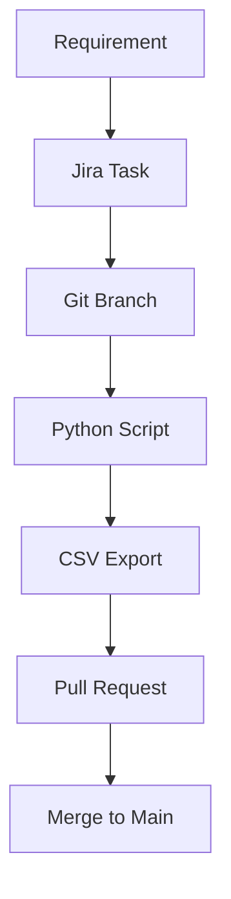

# 🧠 System Design & Traceability – CNC Machine Project

> *“Documentation provides traceability, repeatability, and ensures the understanding is maintained throughout the project life cycle.”*  
> — **NASA Systems Engineering Handbook (SP-6105)**

This repository documents the full mechatronic development workflow of a CNC machine controlled by PLC — combining CAD, control logic, requirements, and production data.  
It follows a lightweight PLM strategy based on version-controlled, transparent artifacts:  
Markdown, CSV, Python scripts, and traceable links to Jira tasks and CAD components.


# 📌 Traceability Graph



---

### 📁 Project Repository Structure Test

```
📦 cnc-machine-plm/
├── 📘 README.md                   ← 🧭 Main entry: stack, traceability, structure
│
├── 📁 plc/                        ← 💡 PLC logic (Structured Text, SFC)
│   ├── 📝 main.st
│   └── 📝 motion_axis_x.st
│
├── 📁 fusion/                     ← 📐 Fusion 360 exports
│   ├── 📊 bom_2025-07-10.csv      ← Bill of Materials
│   ├── 📊 sketch_areas.csv        ← Areas and moments of inertia
│   └── 📊 sensor_locations.csv    ← Sensor positions (optional)
│
├── 📁 requirements/               ← 📑 Engineering requirements (Markdown)
│   ├── 📄 CTX_TABLE_R5.md
│   └── 📄 EQ_FRAME_BASE.md
│
├── 📁 mermaid/                    ← 🧠 System diagrams & traceability maps
│   ├── 📄 system_overview.md      ← e.g. BOM → Jira → Code
│   └── 📄 motion_interfaces.mmd
│
├── 📁 scripts/                    ← 🛠 Automation scripts
│   ├── 🐍 export_sketch_area.py
│   └── 🐍 export_bom.py
│
├── 📁 io/                         ← 🔌 PLC IO signal mapping
│   ├── 📊 io_mapping.csv          ← IO table: %I / %Q ↔ components
│   └── 📄 io_links.md             ← Links between IO, CAD, and REQ
│
└── 📁 docs/                       ← 📎 Reference files (optional)
    ├── 📄 electrical_layout.pdf   ← Electrical schematic (external)
    └── 📄 actuator_specs.pdf
```
